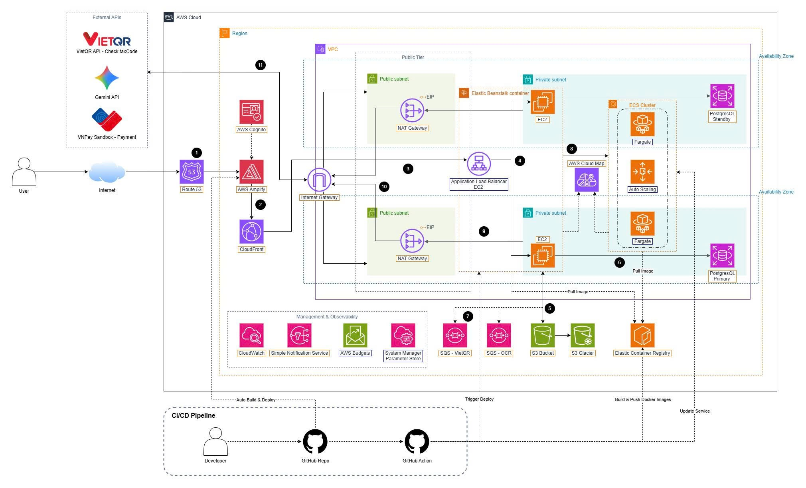

## System Architecture Diagram

## Subnet Table

| Subnet                    | CIDR          | AZ  | Type    | Contains                         |
| ------------------------- | ------------- | --- | ------- | -------------------------------- |
| `smartinvoice-public-1a`  | `10.0.1.0/24` | 1a  | Public  | ALB Public, NAT GW               |
| `smartinvoice-public-1b`  | `10.0.2.0/24` | 1b  | Public  | ALB Public                       |
| `smartinvoice-private-1a` | `10.0.3.0/24` | 1a  | Private | EC2, RDS, ECS Fargate, Cloud Map |
| `smartinvoice-private-1b` | `10.0.4.0/24` | 1b  | Private | EC2 Backend, RDS Standby         |

## Deployment Steps Overview

| Step | Description                          |
| ---- | ------------------------------------ |
| 1    | Choose Region & Prepare              |
| 2    | Create VPC & Subnets                 |
| 3    | Create Internet Gateway              |
| 4    | Create NAT Gateway                   |
| 5    | Create Route Tables                  |
| 6    | Create Security Groups               |
| 7    | Create IAM Roles                     |
| 8    | Create S3 Bucket                     |
| 9    | Create Amazon Cognito                |
| 10   | Create SQS Queues                    |
| 11   | Create SSM Parameter Store           |
| 12   | Create RDS PostgreSQL                |
| 13   | Create ECR & Push Docker Images      |
| 14   | Deploy OCR (ECS Fargate + Cloud Map) |
| 15   | Deploy Backend (Elastic Beanstalk)   |
| 16   | Configure HTTPS (CloudFront)         |
| 17   | Deploy Frontend (Amplify)            |
| 18   | Configure Custom Domain (Route 53)   |
| 19   | CI/CD (GitHub Actions)               |
| 20   | CloudWatch Monitoring                |
| 21   | End-to-End Verification              |

## Estimated Monthly Costs

| Service        | Configuration        | Cost (USD/month) |
| -------------- | -------------------- | ---------------- |
| EC2 (EBS)      | 2x t3.micro          | ~$15             |
| RDS PostgreSQL | db.t3.micro Multi-AZ | ~$28             |
| ECS Fargate    | 2 tasks (0.25 vCPU)  | ~$20             |
| NAT Gateway    | 1 zone + data        | ~$35             |
| ALB (Backend)  | 1 ALB                | ~$18             |
| **TOTAL**      |                      | **~$116**        |
