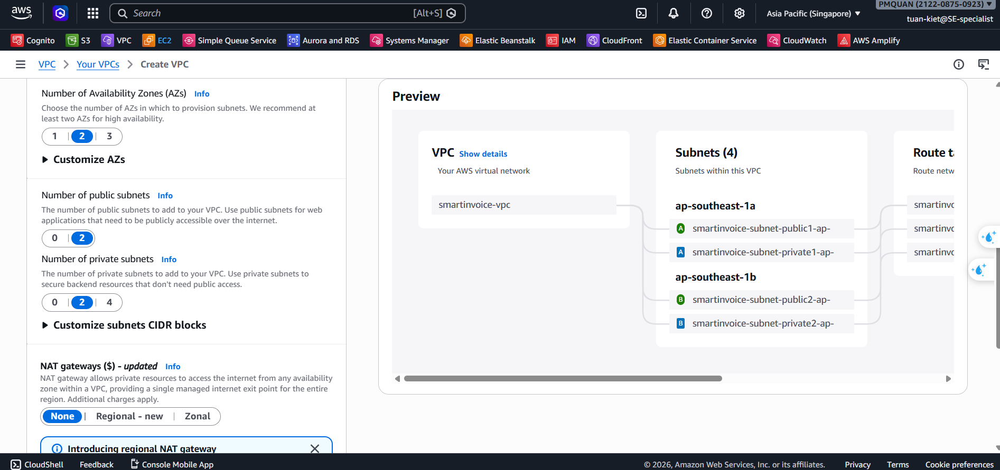
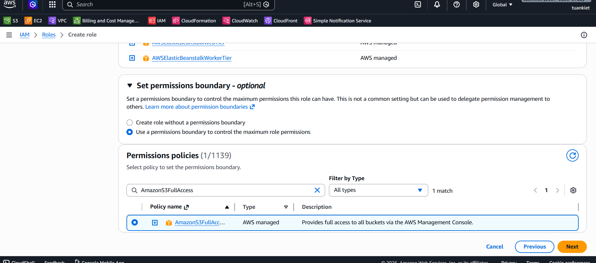
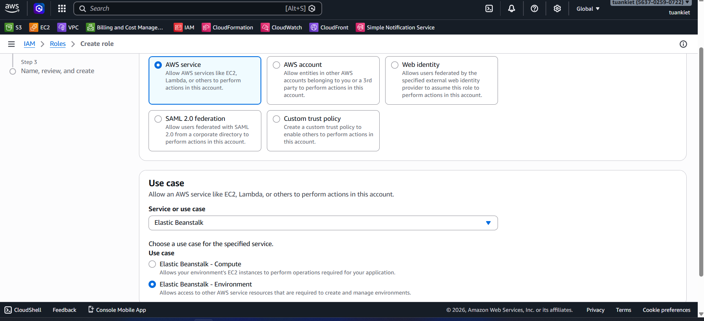

This section covers Steps 2–7 of the deployment: creating the VPC, subnets, internet gateway, NAT gateway, route tables, security groups, and IAM roles.

---

## Step 2: Create VPC & Subnets

### 2.1 Create VPC

**Console**: VPC Dashboard → **Your VPCs** → **Create VPC**

| Field               | Value              |
| ------------------- | ------------------ |
| Resources to create | **VPC and more**   |
| Name tag            | `smartinvoice-vpc` |
| IPv4 CIDR           | `10.0.0.0/16`      |
| Tenancy             | Default            |

### 2.2 Create 4 Subnets

**Console**: VPC → **Subnets** → **Create subnet** (click **Add new subnet** to create all at once)

| #   | Name                      | AZ                | CIDR          |
| --- | ------------------------- | ----------------- | ------------- |
| 1   | `smartinvoice-public-1a`  | `ap-southeast-1a` | `10.0.1.0/24` |
| 2   | `smartinvoice-public-1b`  | `ap-southeast-1b` | `10.0.2.0/24` |
| 3   | `smartinvoice-private-1a` | `ap-southeast-1a` | `10.0.3.0/24` |
| 4   | `smartinvoice-private-1b` | `ap-southeast-1b` | `10.0.4.0/24` |

### 2.3 Enable Auto-assign Public IP

For **each public subnet**: Actions → Edit subnet settings → Enable auto-assign public IPv4

---

## Step 3: Create Internet Gateway

**Console**: VPC → **Internet Gateways** → **Create internet gateway**

| Name tag | `smartinvoice-igw` |
| -------- | ------------------ |

→ **Actions** → **Attach to VPC** → `smartinvoice-vpc` → **Attach** ✅

---

## Step 4: Create NAT Gateway

> NAT Gateway allows Private Subnets to access the Internet (outbound). Cost ~$32/month.

**Console**: VPC → **NAT Gateways** → **Create NAT gateway**

| Field        | Value                                                |
| ------------ | ---------------------------------------------------- |
| Name         | `smartinvoice-nat-gw`                                |
| Subnet       | smartinvoice-public-1a (must be in a Public Subnet!) |
| Connectivity | Public                                               |
| Elastic IP   | Click **Allocate Elastic IP**                        |

Wait for status Available (2–3 minutes).

---

## Step 5: Create Route Tables

### 5.1 Public Route Table

**Console**: VPC → **Route Tables** → **Create route table**

| Name                     | VPC                |
| ------------------------ | ------------------ |
| `smartinvoice-public-rt` | `smartinvoice-vpc` |

**Routes** → Edit → Add: `0.0.0.0/0` → Target: `smartinvoice-igw`

**Subnet associations**: tick `smartinvoice-public-1a` + `smartinvoice-public-1b`

### 5.2 Private Route Table

| Name                      | VPC                |
| ------------------------- | ------------------ |
| `smartinvoice-private-rt` | `smartinvoice-vpc` |

**Routes** → Add: `0.0.0.0/0` → Target: `smartinvoice-nat-gw`

**Subnet associations**: tick `smartinvoice-private-1a` + `smartinvoice-private-1b`

---

## Step 6: Create Security Groups

**Console**: VPC → **Security Groups** → **Create security group** (VPC: `smartinvoice-vpc`)

### SG 1: ALB (`smartinvoice-alb-sg`)

| Inbound | Port | Source      |
| ------- | ---- | ----------- |
| HTTP    | 80   | `0.0.0.0/0` |
| HTTPS   | 443  | `0.0.0.0/0` |

### SG 2: Backend (`smartinvoice-backend-sg`)

| Inbound    | Port | Source                |
| ---------- | ---- | --------------------- |
| HTTP       | 80   | `smartinvoice-alb-sg` |
| Custom TCP | 8080 | `smartinvoice-alb-sg` |

### SG 3: RDS (`smartinvoice-rds-sg`)

| Inbound    | Port | Source                    |
| ---------- | ---- | ------------------------- |
| PostgreSQL | 5432 | `smartinvoice-backend-sg` |
| PostgreSQL | 5432 | `smartinvoice-ocr-sg`     |

### SG 4: OCR (`smartinvoice-ocr-sg`)

| Inbound    | Port | Source                                      |
| ---------- | ---- | ------------------------------------------- |
| Custom TCP | 5000 | `smartinvoice-backend-sg` (Direct internal) |

> All SGs: **Outbound** = All traffic → `0.0.0.0/0`

---

## Step 7: Create IAM Roles

You need to create **4 IAM Roles**. The general procedure for each:

**General Steps**:

1. Go to **IAM Console** → Sidebar → **Roles** → **Create role**.
2. **Step 1**: Trusted entity type: `AWS service`. Select the corresponding service. Click **Next**.
3. **Step 2**: Search and tick the required policies. Click **Next**.
4. **Step 3**: Enter the **Role name** exactly. Click **Create role** ✅.

### 7.1 EB EC2 Role (**aws-elasticbeanstalk-ec2-role**)

Grants EC2 instances in the Backend the right to access other AWS resources.

- **Trusted entity**: **AWS service** → **Elastic Beanstalk** → Use case: **Elastic Beanstalk - Compute**
- **Policies**:
  - `AmazonS3FullAccess`
  - `AmazonSQSFullAccess`
  - `AmazonCognitoPowerUser`
  - `AmazonSSMReadOnlyAccess`
  - `AmazonEC2ContainerRegistryReadOnly`
  - `CloudWatchLogsFullAccess`

### 7.2 EB Service Role (**aws-elasticbeanstalk-service-role**)

Allows Elastic Beanstalk to call AWS services on your behalf.

- **Trusted entity**: **AWS service** → **Elastic Beanstalk** → Use case: **Elastic Beanstalk - Environment**
- **Policies** (auto-attached by AWS):
  - `AWSElasticBeanstalkEnhancedHealth`
  - `AWSElasticBeanstalkManagedUpdatesCustomerRolePolicy`

### 7.3 ECS Execution Role (**ecsTaskExecutionRole**)

Allows ECS Fargate to pull images from ECR and write logs to CloudWatch.

- **Trusted entity**: **AWS service** → **Elastic Container Service** → **Elastic Container Service Task**
- **Policies**:
  - `AmazonECSTaskExecutionRolePolicy`
  - `CloudWatchLogsFullAccess`

### 7.4 ECS Task Role for OCR (**smartinvoice-ecs-task-role**)

Grants direct permissions to the OCR application running in the container.

- **Trusted entity**: **AWS service** → **Elastic Container Service** → **Elastic Container Service Task**
- **Policies**:
  - `AmazonS3FullAccess`
  - `AmazonSQSFullAccess`
  - `AmazonSSMReadOnlyAccess`
