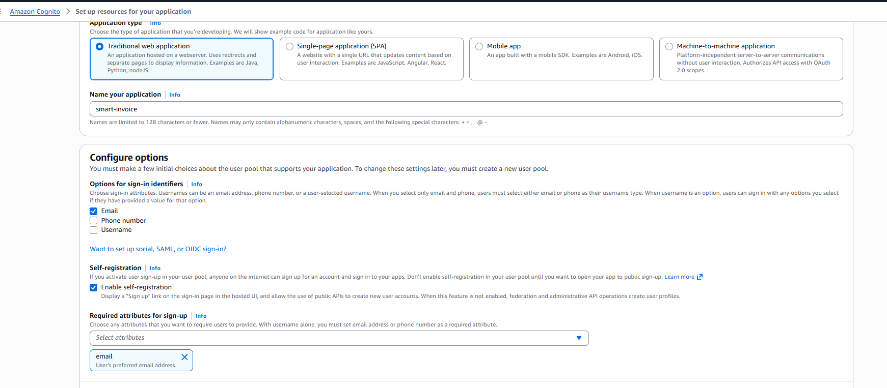
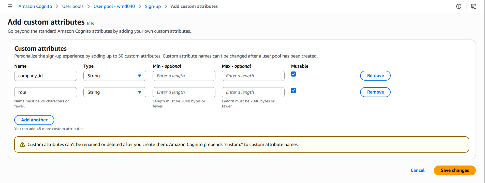

This section covers Steps 8–12: creating the S3 bucket, Amazon Cognito user pool, SQS queues, SSM Parameter Store, and the RDS PostgreSQL database.

---

## Step 8: Create S3 Bucket

**Console**: S3 → **Create bucket**

| Field                       | Value                          |
| --------------------------- | ------------------------------ |
| Bucket name                 | `smart-invoice-shield-storage` |
| Region                      | `ap-southeast-1`               |
| **Block all public access** | ✅ **Block all**               |
| Default encryption          | SSE-S3                         |

> [!CAUTION]
> Do NOT enable public access. Invoice files are accessed only via Presigned URLs.

---

## Step 9: Create Amazon Cognito

### 9.1 Create User Pool

**Console**: Cognito → **Create user pool**

| Field               | Value                           |
| ------------------- | ------------------------------- |
| Application type    | **Traditional web application** |
| App client name     | `smart-invoice`                 |
| Sign-in identifiers | **Email**                       |
| Self-registration   | ✅ Enable                       |
| Required attributes | **email**                       |

### 9.2 Add Custom Attributes

User Pool → Authentication → Sign-up → **Add custom attributes**:

- `company_id` (String)
- `role` (String)

→ Save

### 9.3 Enable Password Auth

App clients → `smart-invoice` → **Edit** → ✅ **ALLOW_USER_PASSWORD_AUTH** → **Save**

### 9.4 Note Down Credentials

| Information       | Where to find                   |
| ----------------- | ------------------------------- |
| **User Pool ID**  | Overview (`ap-southeast-1_XXX`) |
| **Client ID**     | App clients                     |
| **Client Secret** | App clients → Show              |

---

## Step 10: Create SQS Queues

### Queue 1: OCR Queue

**Console**: SQS → **Create queue**

| Field                     | Value                    |
| ------------------------- | ------------------------ |
| Type                      | Standard                 |
| Name                      | `smartinvoice-ocr-queue` |
| Visibility timeout        | `450` seconds            |
| Receive message wait time | `20` seconds             |

### Queue 2: VietQR Queue

| Field                     | Value                       |
| ------------------------- | --------------------------- |
| Type                      | Standard                    |
| Name                      | `smartinvoice-vietqr-queue` |
| Visibility timeout        | `30` seconds                |
| Receive message wait time | `20` seconds                |

→ Note down the **Queue URL** for both queues.

---

## Step 11: Create SSM Parameter Store

**Console**: Systems Manager → **Parameter Store** → **Create parameter**

| Parameter Name                             | Type             | Value                                           |
| ------------------------------------------ | ---------------- | ----------------------------------------------- |
| `/SmartInvoice/prod/COGNITO_USER_POOL_ID`  | String           | (from Step 9)                                   |
| `/SmartInvoice/prod/COGNITO_CLIENT_ID`     | String           | (from Step 9)                                   |
| `/SmartInvoice/prod/COGNITO_CLIENT_SECRET` | **SecureString** | (from Step 9)                                   |
| `/SmartInvoice/prod/AWS_SQS_OCR_URL`       | String           | (Step 10 — OCR queue URL)                       |
| `/SmartInvoice/prod/AWS_SQS_URL`           | String           | (Step 10 — VietQR queue URL)                    |
| `/SmartInvoice/prod/POSTGRES_HOST`         | String           | (Step 12 — RDS endpoint)                        |
| `/SmartInvoice/prod/POSTGRES_PORT`         | String           | `5432`                                          |
| `/SmartInvoice/prod/POSTGRES_DB`           | String           | `SmartInvoiceDb`                                |
| `/SmartInvoice/prod/POSTGRES_USER`         | String           | `postgres`                                      |
| `/SmartInvoice/prod/POSTGRES_PASSWORD`     | **SecureString** | (RDS password)                                  |
| `/SmartInvoice/prod/AWS_REGION`            | String           | `ap-southeast-1`                                |
| `/SmartInvoice/prod/AWS_S3_BUCKET_NAME`    | String           | `smart-invoice-shield-storage`                  |
| `/SmartInvoice/prod/OCR_API_ENDPOINT`      | String           | `http://<ALB_OCR_DNS>` (update after Step 14.4) |
| `/SmartInvoice/prod/ALLOWED_ORIGINS`       | String           | (update after Step 17)                          |

---

## Step 12: Create RDS PostgreSQL

### 12.1 Create DB Subnet Group

**Console**: RDS → **Subnet groups** → **Create**

| Field   | Value                          |
| ------- | ------------------------------ |
| Name    | `smartinvoice-db-subnet-group` |
| VPC     | `smartinvoice-vpc`             |
| Subnets | Both private subnets (1a + 1b) |

### 12.2 Create Database

**Console**: RDS → **Databases** → **Create database**

| Field                  | Value                               |
| ---------------------- | ----------------------------------- |
| Engine                 | PostgreSQL 16.x                     |
| Creation method        | **Full configuration**              |
| Template               | **Free tier / Dev-Test**            |
| Deployment options     | **Multi-AZ DB instance deployment** |
| DB identifier          | `smartinvoice-db`                   |
| Master username        | `postgres`                          |
| Credentials management | **Self managed**                    |
| Master password        | [YOUR_SECURE_PASSWORD]              |
| Instance class         | `db.t3.micro`                       |
| Storage                | 20 GB gp3                           |
| VPC                    | `smartinvoice-vpc`                  |
| Subnet group           | `smartinvoice-db-subnet-group`      |
| Public access          | ❌ No                               |
| Security group         | `smartinvoice-rds-sg`               |
| Initial DB name        | `SmartInvoiceDb`                    |
| Backup retention       | 7 days                              |

→ Wait 5–10 minutes → Note down the **Endpoint** → Update SSM parameter `POSTGRES_HOST`.
