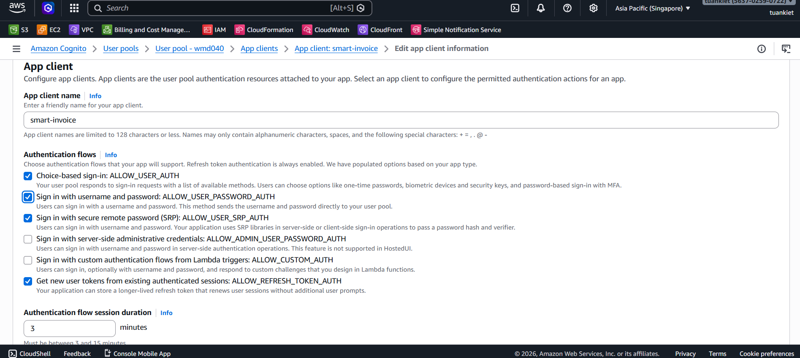
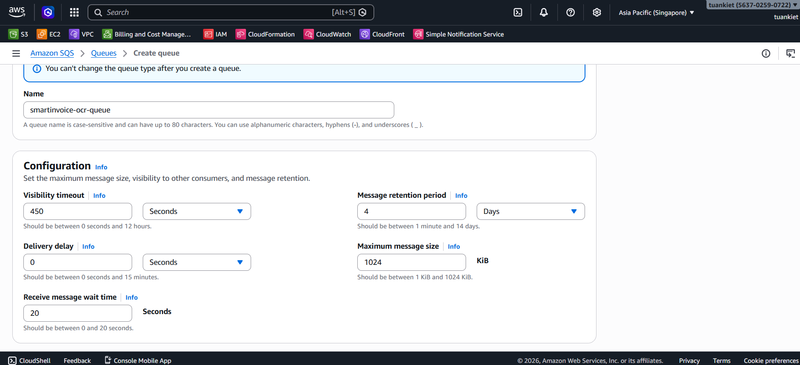
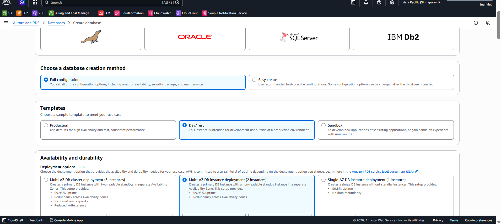
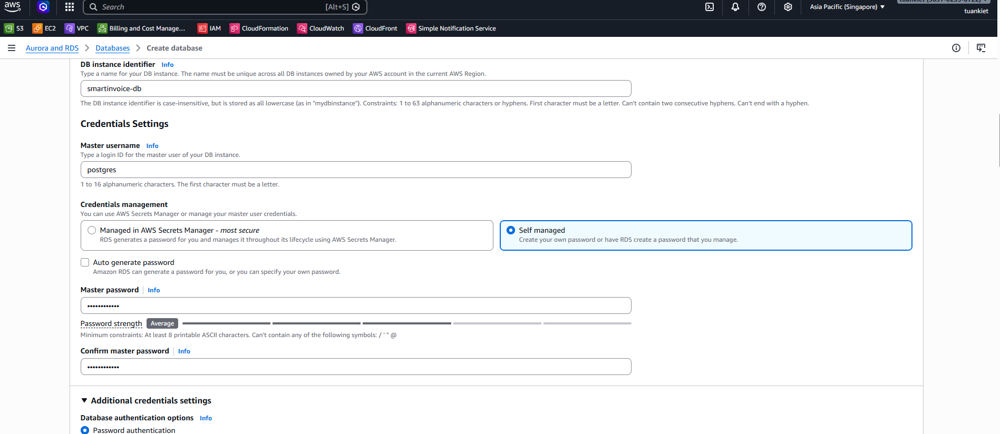

Phần này bao gồm các Bước 8–12: tạo S3 bucket, Amazon Cognito user pool, SQS queues, SSM Parameter Store, và cơ sở dữ liệu RDS PostgreSQL.

---

## Bước 8: Tạo S3 Bucket

**Console**: S3 → **Create bucket**

| Trường                      | Giá trị                        |
| --------------------------- | ------------------------------ |
| Bucket name                 | `smart-invoice-shield-storage` |
| Region                      | `ap-southeast-1`               |
| **Block all public access** | ✅ **Block all**               |
| Default encryption          | SSE-S3                         |

> [!CAUTION]
> KHÔNG bật Public Access. File hóa đơn chỉ được truy cập qua Presigned URL.

---

## Bước 9: Tạo Amazon Cognito

### 9.1 Tạo User Pool

**Console**: Cognito → **Create user pool**

| Trường              | Giá trị                         |
| ------------------- | ------------------------------- |
| Application type    | **Traditional web application** |
| App client name     | `smart-invoice`                 |
| Sign-in identifiers | **Email**                       |
| Self-registration   | ✅ Enable                       |
| Required attributes | **email**                       |

### 9.2 Thêm Custom Attributes

User Pool → Authentication → Sign-up → **Add custom attributes**:

- `company_id` (String)
- `role` (String)

→ Save

### 9.3 Bật Password Auth

App clients → `smart-invoice` → **Edit** → ✅ **ALLOW_USER_PASSWORD_AUTH** → **Save**

### 9.4 Ghi lại thông tin

| Thông tin         | Nơi tìm                         |
| ----------------- | ------------------------------- |
| **User Pool ID**  | Overview (`ap-southeast-1_XXX`) |
| **Client ID**     | App clients                     |
| **Client Secret** | App clients → Show              |

---

## Bước 10: Tạo SQS Queues

### Queue 1: OCR Queue

**Console**: SQS → **Create queue**

| Trường                    | Giá trị                  |
| ------------------------- | ------------------------ |
| Type                      | Standard                 |
| Name                      | `smartinvoice-ocr-queue` |
| Visibility timeout        | `450` seconds            |
| Receive message wait time | `20` seconds             |

### Queue 2: VietQR Queue

| Trường                    | Giá trị                     |
| ------------------------- | --------------------------- |
| Type                      | Standard                    |
| Name                      | `smartinvoice-vietqr-queue` |
| Visibility timeout        | `30` seconds                |
| Receive message wait time | `20` seconds                |

→ Ghi lại **Queue URL** cho cả 2 queue.

---

## Bước 11: Tạo SSM Parameter Store

**Console**: Systems Manager → **Parameter Store** → **Create parameter**

| Tên tham số                                | Loại             | Giá trị                                         |
| ------------------------------------------ | ---------------- | ----------------------------------------------- |
| `/SmartInvoice/prod/COGNITO_USER_POOL_ID`  | String           | (từ Bước 9)                                     |
| `/SmartInvoice/prod/COGNITO_CLIENT_ID`     | String           | (từ Bước 9)                                     |
| `/SmartInvoice/prod/COGNITO_CLIENT_SECRET` | **SecureString** | (từ Bước 9)                                     |
| `/SmartInvoice/prod/AWS_SQS_OCR_URL`       | String           | (Bước 10 — OCR queue URL)                       |
| `/SmartInvoice/prod/AWS_SQS_URL`           | String           | (Bước 10 — VietQR queue URL)                    |
| `/SmartInvoice/prod/POSTGRES_HOST`         | String           | (Bước 12 — RDS endpoint)                        |
| `/SmartInvoice/prod/POSTGRES_PORT`         | String           | `5432`                                          |
| `/SmartInvoice/prod/POSTGRES_DB`           | String           | `SmartInvoiceDb`                                |
| `/SmartInvoice/prod/POSTGRES_USER`         | String           | `postgres`                                      |
| `/SmartInvoice/prod/POSTGRES_PASSWORD`     | **SecureString** | (RDS password)                                  |
| `/SmartInvoice/prod/AWS_REGION`            | String           | `ap-southeast-1`                                |
| `/SmartInvoice/prod/AWS_S3_BUCKET_NAME`    | String           | `smart-invoice-shield-storage`                  |
| `/SmartInvoice/prod/OCR_API_ENDPOINT`      | String           | `http://<ALB_OCR_DNS>` (cập nhật sau Bước 14.4) |
| `/SmartInvoice/prod/ALLOWED_ORIGINS`       | String           | (cập nhật sau Bước 17)                          |

---

## Bước 12: Tạo RDS PostgreSQL

### 12.1 Tạo DB Subnet Group

**Console**: RDS → **Subnet groups** → **Create**

| Trường  | Giá trị                        |
| ------- | ------------------------------ |
| Name    | `smartinvoice-db-subnet-group` |
| VPC     | `smartinvoice-vpc`             |
| Subnets | Cả 2 private subnets (1a + 1b) |

### 12.2 Tạo Database

**Console**: RDS → **Databases** → **Create database**

| Trường                            | Giá trị                             |
| --------------------------------- | ----------------------------------- |
| Engine                            | PostgreSQL 16.x                     |
| Choose a database creation method | **Full configuration**              |
| Template                          | **Free tier / Dev-Test**            |
| Deployment options                | **Multi-AZ DB instance deployment** |
| DB identifier                     | `smartinvoice-db`                   |
| Master username                   | `postgres`                          |
| Credentials management            | **Self managed**                    |
| Master password                   | [MẬT_KHẨU_AN_TOÀN_CỦA_BẠN]          |
| Instance class                    | `db.t3.micro`                       |
| Storage                           | 20 GB gp3                           |
| VPC                               | `smartinvoice-vpc`                  |
| Subnet group                      | `smartinvoice-db-subnet-group`      |
| Public access                     | ❌ No                               |
| Security group                    | `smartinvoice-rds-sg`               |
| Initial DB name                   | `SmartInvoiceDb`                    |
| Backup retention                  | 7 days                              |

→ Chờ 5–10 phút → Ghi lại **Endpoint** → Cập nhật SSM parameter `POSTGRES_HOST`.
