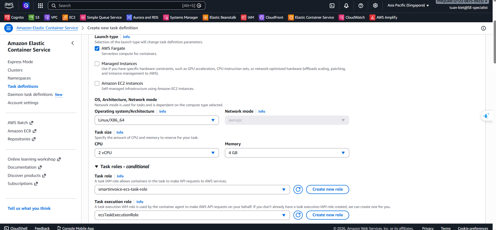
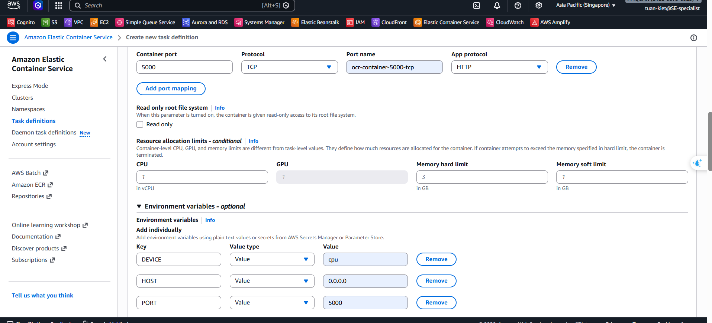
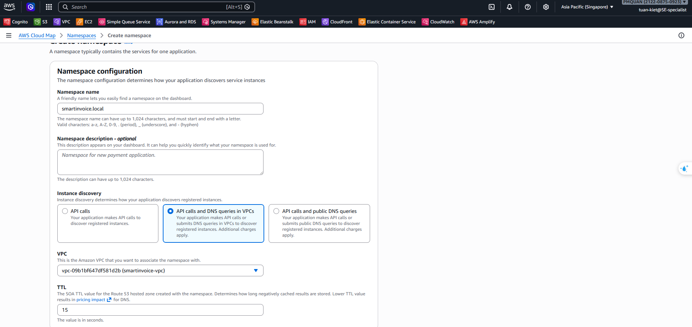
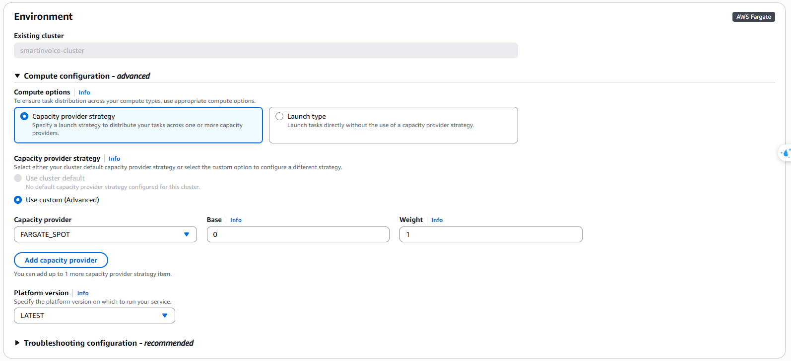
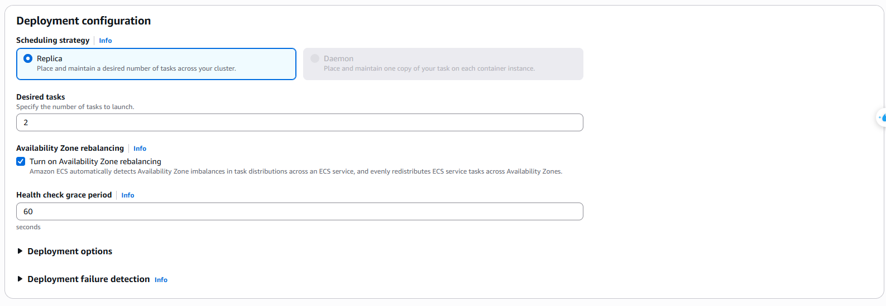
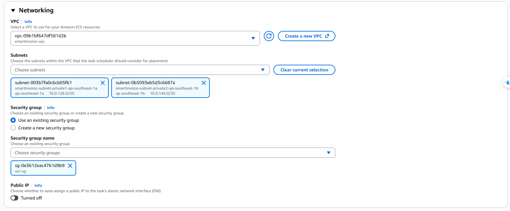
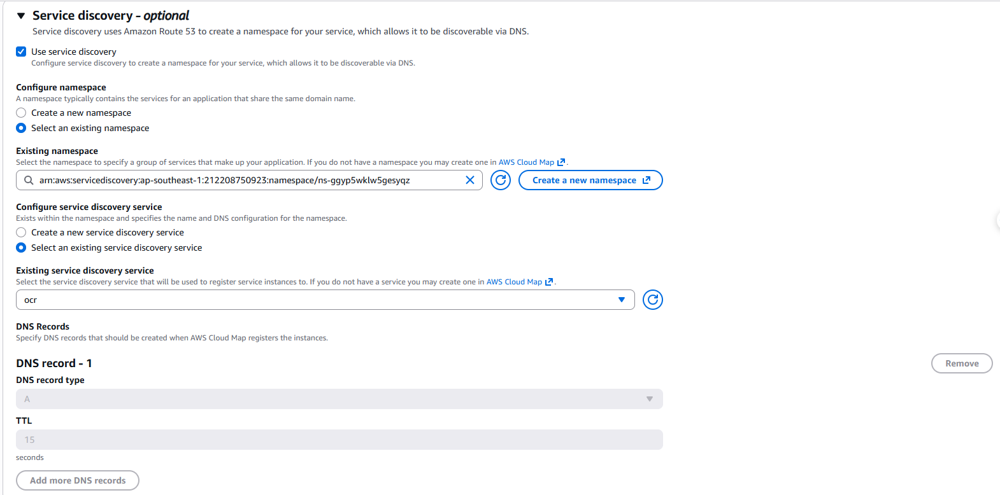
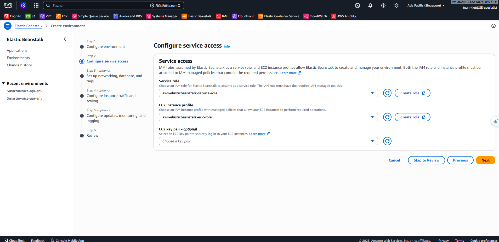
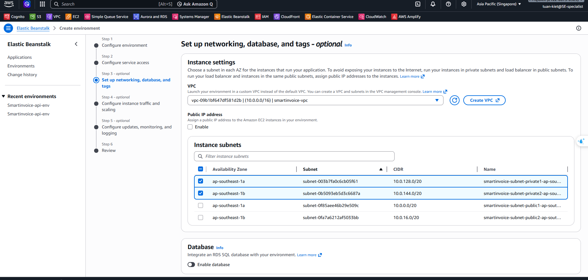
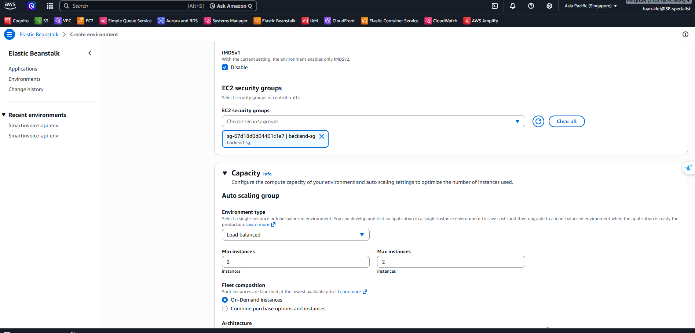

This section covers Steps 13–15: building and pushing Docker images to ECR, deploying the OCR service on ECS Fargate, and deploying the Backend on Elastic Beanstalk.

---

## Step 13: Create ECR & Push Docker Images

### 13.1 Create Repositories on ECR

```bash
aws ecr create-repository --repository-name smartinvoice-backend --region ap-southeast-1
aws ecr create-repository --repository-name smartinvoice-ocr --region ap-southeast-1
```

_(Or manually via Console: ECR → Repositories → Create repository)_

### 13.2 Authenticate Docker to AWS ECR

Replace `<ACCOUNT_ID>` with your 12-digit AWS Account ID:

```bash
aws ecr get-login-password --region ap-southeast-1 | \
  docker login --username AWS --password-stdin <ACCOUNT_ID>.dkr.ecr.ap-southeast-1.amazonaws.com
```

### 13.3 Build & Push Backend (.NET 9)

```bash
# Move into the API folder
cd SmartInvoice.API

# Build Docker image
docker build -t smartinvoice-backend .

# Tag to match the ECR repository
docker tag smartinvoice-backend:latest <ACCOUNT_ID>.dkr.ecr.ap-southeast-1.amazonaws.com/smartinvoice-backend:latest

# Push to AWS
docker push <ACCOUNT_ID>.dkr.ecr.ap-southeast-1.amazonaws.com/smartinvoice-backend:latest
```

### 13.4 Build & Push OCR Service (Python)

> [!NOTE]
> The OCR image is large (~2–3 GB). Ensure a stable internet connection.

```bash
# Move into the OCR folder
cd ../invoice_ocr

# Build Docker image
docker build -t smartinvoice-ocr .

# Tag
docker tag smartinvoice-ocr:latest <ACCOUNT_ID>.dkr.ecr.ap-southeast-1.amazonaws.com/smartinvoice-ocr:latest

# Push to AWS
docker push <ACCOUNT_ID>.dkr.ecr.ap-southeast-1.amazonaws.com/smartinvoice-ocr:latest
```

> [!TIP]
> If you get a "Permission Denied" error on push, verify that your IAM User has the `AmazonEC2ContainerRegistryFullAccess` policy.

---

## Step 14: Deploy OCR on ECS Fargate

### 14.1 Create ECS Cluster

**Console**: ECS → Clusters → **Create**

| Field          | Value                  |
| -------------- | ---------------------- |
| Cluster name   | `smartinvoice-cluster` |
| Infrastructure | **Fargate only**       |

### 14.2 Create Task Definition

**Console**: ECS → Task definitions → **Create new task definition**



| Field           | Value                                     |
| --------------- | ----------------------------------------- | --- |
| Family          | `smartinvoice-ocr-task`                   |
| Launch type     | **AWS Fargate**                           |
| OS/Architecture | **Linux/X86_64**                          |
| CPU             | `2 vCPU`                                  |
| Memory          | `4 GB`                                    |
| Task role       | `smartinvoice-ecs-task-role`              |
| Execution role  | `ecsTaskExecutionRole`                    |
| Container name  | `ocr-container`                           |
| Image URI       | ECR URI from step 13.4                    |
| Port            | `5000`                                    |
| Environment     | `DEVICE=cpu`, `HOST=0.0.0.0`, `PORT=5000` |
| Logs            | `awslogs` → `/ecs/smartinvoice-ocr-task`  | \   |



### 14.3 Create Cloud Map Namespace

> [!TIP]
> **Cost Saving**: Cloud Map allows services to discover each other via internal DNS (e.g., `ocr.smartinvoice.local`), saving approximately **$18/month** by eliminating the need for an Internal Load Balancer.

**Console**: AWS Cloud Map → **Create namespace**

| Field              | Value                                         |
| ------------------ | --------------------------------------------- |
| Namespace name     | `smartinvoice.local`                          |
| Instance discovery | `API calls and DNS queries in VPCs` (Private) |
| VPC                | `smartinvoice-vpc`                            |



### 14.4 Service Discovery Configuration

When creating the ECS Service in the next step, AWS will automatically register the IP addresses of your running tasks into the `ocr.smartinvoice.local` domain name. This allows the Backend to call the OCR service directly.

### 14.5 Deploy ECS Service

**Console**: ECS → Clusters → `smartinvoice-cluster` → **Services** → **Create**

#### A. Compute configuration

- **Compute options**: **Capacity provider strategy**
- **Strategy**: **Use custom (Advanced)** → **Fargate spot** (Cost saving: 50-70%) (Weight: 1, Base: 0)



#### B. Deployment configuration

- **Application type**: **Service**
- **Task definition**: Family `smartinvoice-ocr-task` (LATEST)
- **Service name**: `smartinvoice-ocr-task-service`
- **Desired tasks**: `2`
- **Deployment controller**: **Rolling update**



#### C. Networking

- **VPC**: `smartinvoice-vpc`
- **Subnets**: Select both **Private** subnets (1a, 1b)
- **Security group**: `smartinvoice-ocr-sg`
- **Public IP**: ❌ **Turned off** (required for Private Subnet)



#### D. Load balancing & Service discovery

- **Load balancing**: Select 🔵 **None** (to save costs).
- **Service discovery**:
  - **Use service discovery**: ✅ (Check this).
  - **Namespace**: Select `smartinvoice.local`.
  - **Service name**: Enter `ocr`.
  - **DNS record type**: Select `A` record.
  - **TTL**: `15` / `60` seconds.



→ Click **Create** ✅. Once the Service is `Running`, update the `/SmartInvoice/prod/OCR_API_ENDPOINT` parameter in SSM to `http://ocr.smartinvoice.local:5000`.

---

## Step 15: Deploy Backend on Elastic Beanstalk

### 15.1 Step 1: Configure Environment

| Field            | Value                                            |
| ---------------- | ------------------------------------------------ |
| Environment tier | **Web server environment**                       |
| Application name | `Smartinvoice-api`                               |
| Environment name | `Smartinvoice-api-env`                           |
| Platform         | **Docker**                                       |
| Platform branch  | **Docker running on 64bit Amazon Linux 2023**    |
| Application code | **Sample application** (CI/CD will deploy later) |
| Presets          | **Single instance**                              |


### 15.2 Step 2: Configure Service Access

| Field                | Value                               |
| -------------------- | ----------------------------------- |
| Service role         | `aws-elasticbeanstalk-service-role` |
| EC2 instance profile | `aws-elasticbeanstalk-ec2-role`     |



### 15.3 Step 3: Networking

| Field             | Value                         |
| ----------------- | ----------------------------- |
| VPC               | `smartinvoice-vpc`            |
| Public IP address | ❌ Do NOT enable              |
| Instance subnets  | **Private** subnets (1a + 1b) |



### 15.4 Step 4: Instance Traffic & Scaling

| Field               | Value                     |
| ------------------- | ------------------------- |
| IMDSv1              | ✅ **Disable**            |
| EC2 security groups | `smartinvoice-backend-sg` |
| Environment type    | **Load balanced**         |
| Instance type       | `t3.micro`                |
| Scaling Min / Max   | `2` / `2`                 |



### 15.5 Step 5: Monitoring

- **Monitoring**: `Basic` (or `Enhanced` for detailed metrics)

### 15.6 Step 6: Review & Create

Click **Submit** and wait 5–10 minutes for the environment to be provisioned.

### 15.7 Dockerrun.aws.json (for CI/CD)

After the environment is ready, this file is used by GitHub Actions to deploy code from ECR:

```json
{
  "AWSEBDockerrunVersion": "1",
  "Image": {
    "Name": "<ACCOUNT_ID>.dkr.ecr.ap-southeast-1.amazonaws.com/smartinvoice-backend:latest",
    "Update": "true"
  },
  "Ports": [
    {
      "ContainerPort": 8080,
      "HostPort": 80
    }
  ]
}
```
