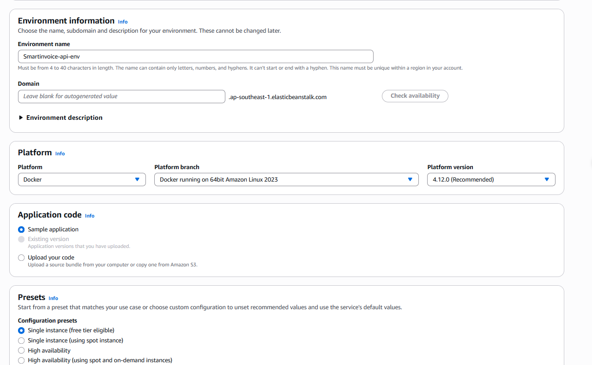

Phần này bao gồm các Bước 13–15: build và push Docker image lên ECR, triển khai OCR service trên ECS Fargate, và triển khai Backend trên Elastic Beanstalk.

---

## Bước 13: Tạo ECR & Push Docker Images

### 13.1 Tạo Repositories trên ECR

```bash
aws ecr create-repository --repository-name smartinvoice-backend --region ap-southeast-1
aws ecr create-repository --repository-name smartinvoice-ocr --region ap-southeast-1
```

_(Hoặc tạo thủ công trên Console: ECR → Repositories → Create repository)_

### 13.2 Đăng nhập Docker vào AWS ECR

Thay `<ACCOUNT_ID>` bằng 12 số ID tài khoản AWS của bạn:

```bash
aws ecr get-login-password --region ap-southeast-1 | \
  docker login --username AWS --password-stdin <ACCOUNT_ID>.dkr.ecr.ap-southeast-1.amazonaws.com
```

### 13.3 Build & Push Backend (.NET 9)

```bash
# Di chuyển vào thư mục code API
cd SmartInvoice.API

# Build ảnh Docker
docker build -t smartinvoice-backend .

# Gắn thẻ (Tag) để khớp với kho chứa trên AWS
docker tag smartinvoice-backend:latest <ACCOUNT_ID>.dkr.ecr.ap-southeast-1.amazonaws.com/smartinvoice-backend:latest

# Đẩy (Push) lên AWS
docker push <ACCOUNT_ID>.dkr.ecr.ap-southeast-1.amazonaws.com/smartinvoice-backend:latest
```

### 13.4 Build & Push OCR Service (Python)

> [!NOTE]
> Ảnh OCR khá nặng (~2–3 GB). Đảm bảo mạng ổn định trước khi thực hiện.

```bash
# Di chuyển vào thư mục ocr
cd ../invoice_ocr

# Build ảnh Docker
docker build -t smartinvoice-ocr .

# Gắn thẻ
docker tag smartinvoice-ocr:latest <ACCOUNT_ID>.dkr.ecr.ap-southeast-1.amazonaws.com/smartinvoice-ocr:latest

# Đẩy lên AWS
docker push <ACCOUNT_ID>.dkr.ecr.ap-southeast-1.amazonaws.com/smartinvoice-ocr:latest
```

> [!TIP]
> Nếu gặp lỗi "Permission Denied" khi push, kiểm tra xem IAM User của bạn có quyền `AmazonEC2ContainerRegistryFullAccess` chưa.

---

## Bước 14: Triển khai OCR trên ECS Fargate

### 14.1 Tạo ECS Cluster

**Console**: ECS → Clusters → **Create**

| Trường         | Giá trị                |
| -------------- | ---------------------- |
| Cluster name   | `smartinvoice-cluster` |
| Infrastructure | **Fargate only**       |

### 14.2 Tạo Task Definition

**Console**: ECS → Task definitions → **Create new task definition**


| Trường          | Giá trị                                   |
| --------------- | ----------------------------------------- |
| Family          | `smartinvoice-ocr-task`                   |
| Launch type     | **AWS Fargate**                           |
| OS/Architecture | **Linux/X86_64**                          |
| CPU             | `2 vCPU`                                  |
| Memory          | `4 GB`                                    |
| Task role       | `smartinvoice-ecs-task-role`              |
| Execution role  | `ecsTaskExecutionRole`                    |
| Container name  | `ocr-container`                           |
| Image URI       | ECR URI từ bước 13.4                      |
| Port            | `5000`                                    |
| Environment     | `DEVICE=cpu`, `HOST=0.0.0.0`, `PORT=5000` |
| Logs            | `awslogs` → `/ecs/smartinvoice-ocr-task`  |


### 14.3 Tạo Cloud Map Namespace

> [!TIP]
> **Tiết kiệm chi phí**: Cloud Map giúp các dịch vụ gọi nhau bằng tên miền nội bộ (VD: `ocr.smartinvoice.local`) giúp tiết kiệm chi phí Load Balancer (**~$18/tháng**).

**Console**: AWS Cloud Map → **Create namespace**

| Trường             | Giá trị                                       |
| ------------------ | --------------------------------------------- |
| Namespace name     | `smartinvoice.local`                          |
| Instance discovery | `API calls and DNS queries in VPCs` (Private) |
| VPC                | `smartinvoice-vpc`                            |


### 14.4 Cấu hình Service Discovery cho OCR

Khi tạo Service ở bước tiếp theo, bạn sẽ kết nối nó với Namespace này. Sau khi hoàn tất, AWS sẽ tự động gán IP của các Task vào tên miền `ocr.smartinvoice.local`. Điều này cho phép Backend gọi trực tiếp service OCR thông qua tên miền nội bộ này.

### 14.5 Triển khai Service trên ECS

**Console**: ECS → Clusters → `smartinvoice-cluster` → **Services** → **Create**

#### A. Compute configuration

- **Compute options**: **Capacity provider strategy**
- **Strategy**: **Use custom (Advanced)** → **Fargate spot** (Tiết kiệm 50-70% chi phí) (Weight: 1, Base: 0)


#### B. Deployment configuration

- **Application type**: **Service**
- **Task definition**: Family `smartinvoice-ocr-task` (LATEST)
- **Service name**: `smartinvoice-ocr-task-service`
- **Desired tasks**: `2`
- **Deployment controller**: **Rolling update**


#### C. Networking

- **VPC**: `smartinvoice-vpc`
- **Subnets**: Chọn cả 2 **Private** subnets (1a, 1b)
- **Security group**: `smartinvoice-ocr-sg`
- **Public IP**: ❌ **Turned off** (Bắt buộc vì nằm trong Private Subnet)


#### D. Load balancing & Service discovery

- **Load balancing**: Chọn 🔵 **None** (Để tiết kiệm chi phí).
- **Service discovery**:
  - **Use service discovery**: ✅ (Tick chọn).
  - **Namespace**: Chọn `smartinvoice.local`.
  - **Service name**: Nhập `ocr`.
  - **DNS record type**: Chọn `A` record.
  - **TTL**: `15` / `60` seconds.


→ Sau khi Service ở trạng thái `Running`, hãy cập nhật tham số `/SmartInvoice/prod/OCR_API_ENDPOINT` trong SSM thành `http://ocr.smartinvoice.local:5000`.

---

## Bước 15: Triển khai Backend trên Elastic Beanstalk

### 15.1 Bước 1: Cấu hình môi trường

| Trường           | Giá trị                                        |
| ---------------- | ---------------------------------------------- |
| Environment tier | **Web server environment**                     |
| Application name | `Smartinvoice-api`                             |
| Environment name | `Smartinvoice-api-env`                         |
| Platform         | **Docker**                                     |
| Platform branch  | **Docker running on 64bit Amazon Linux 2023**  |
| Application code | **Sample application** (CI/CD sẽ đẩy code sau) |
| Presets          | **Single instance**                            |



### 15.2 Bước 2: Service Access

| Trường               | Giá trị                             |
| -------------------- | ----------------------------------- |
| Service role         | `aws-elasticbeanstalk-service-role` |
| EC2 instance profile | `aws-elasticbeanstalk-ec2-role`     |


### 15.3 Bước 3: Mạng

| Trường            | Giá trị                       |
| ----------------- | ----------------------------- |
| VPC               | `smartinvoice-vpc`            |
| Public IP address | ❌ Không tick Enable          |
| Instance subnets  | **Private** subnets (1a + 1b) |


### 15.4 Bước 4: Instance & Scaling

| Trường              | Giá trị                   |
| ------------------- | ------------------------- |
| IMDSv1              | ✅ **Disable**            |
| EC2 security groups | `smartinvoice-backend-sg` |
| Environment type    | **Load balanced**         |
| Instance type       | `t3.micro`                |
| Scaling Min / Max   | `2` / `2`                 |


### 15.5 Bước 5: Monitoring

- **Monitoring**: `Basic` (hoặc `Enhanced` để xem chi tiết hơn)

### 15.6 Bước 6: Review & Create

Nhấn **Submit** và đợi 5–10 phút để môi trường được khởi tạo.

### 15.7 File Dockerrun.aws.json (cho CI/CD)

Sau khi môi trường sẵn sàng, file này sẽ được dùng bởi GitHub Actions để triển khai code từ ECR:

```json
{
  "AWSEBDockerrunVersion": "1",
  "Image": {
    "Name": "<ACCOUNT_ID>.dkr.ecr.ap-southeast-1.amazonaws.com/smartinvoice-backend:latest",
    "Update": "true"
  },
  "Ports": [
    {
      "ContainerPort": 8080,
      "HostPort": 80
    }
  ]
}
```
