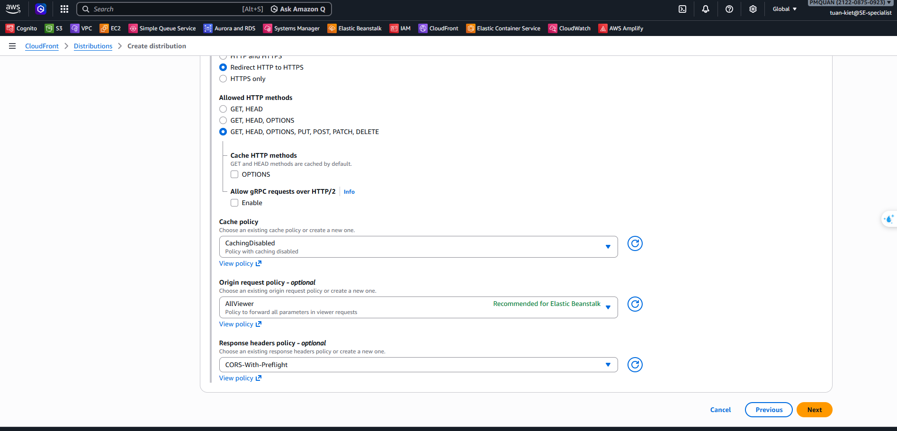
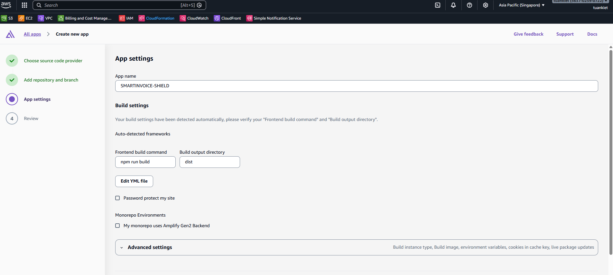

This section covers Steps 16–17: configuring CloudFront as an HTTPS proxy for the Backend API, and deploying the React frontend on AWS Amplify.

---

## Step 16: Configure HTTPS with CloudFront (Backend Proxy)

CloudFront acts as the public HTTPS gateway for the Backend API.

### 16.1 Get Started

**Console**: CloudFront → **Create distribution**

| Field             | Value                        |
| ----------------- | ---------------------------- |
| Distribution name | `smartinvoice-backend-proxy` |
| Distribution type | **Single website or app**    |

### 16.2 Specify Origin

| Field         | Value                                                                                        |
| ------------- | -------------------------------------------------------------------------------------------- |
| Origin type   | **Elastic Load Balancer**                                                                    |
| Origin domain | DNS Name of the **EB ALB** (e.g. `awseb-e-m-AWSEBLoa-xxxx.ap-southeast-1.elb.amazonaws.com`) |
| Protocol      | **HTTP only**, HTTP Port: `80`                                                               |

### 16.3 Default Cache Behavior

| Field                   | Value                                            |
| ----------------------- | ------------------------------------------------ |
| Viewer protocol policy  | **Redirect HTTP to HTTPS**                       |
| Allowed HTTP methods    | **GET, HEAD, OPTIONS, PUT, POST, PATCH, DELETE** |
| Cache policy            | `CachingDisabled`                                |
| Origin request policy   | `AllViewerExceptHostHeader`                      |
| Response headers policy | `CORS-With-Preflight`                            |

### 16.4 Security & Review

- **Rate limiting**: ✅ Enable (Recommended — protects against API spam)

→ Click **Create distribution** and wait ~5 minutes for deployment.

→ Note down the **CloudFront domain** (e.g. `https://d3xxxx.cloudfront.net`) — you will use this as the API URL for the frontend.

---

## Step 17: Deploy Frontend on Amplify

### 17.1 Connect Branch

1. **Console**: AWS Amplify → **All apps** → **New app** → **Host web app**.
2. Connect GitHub Repository `tuankiet18-dev/SMARTINVOICE-SHIELD`, select branch `main`.

### 17.2 Build Settings (amplify.yml)

Amplify auto-detects Vite. Verify under App settings → Build settings:

### 17.3 Environment Variables

**Console**: App settings → **Environment variables** → Add:

| Key            | Value                                                                     |
| -------------- | ------------------------------------------------------------------------- |
| `VITE_API_URL` | CloudFront domain from Step 16 (e.g. `https://d3xxxx.cloudfront.net/api`) |

→ After deployment, copy the **Amplify URL** and update SSM parameter `ALLOWED_ORIGINS`.
