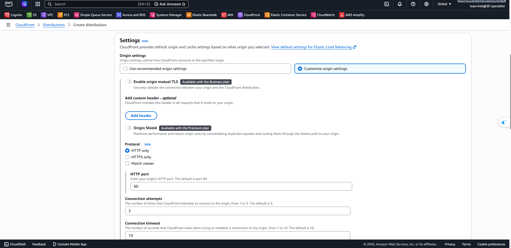
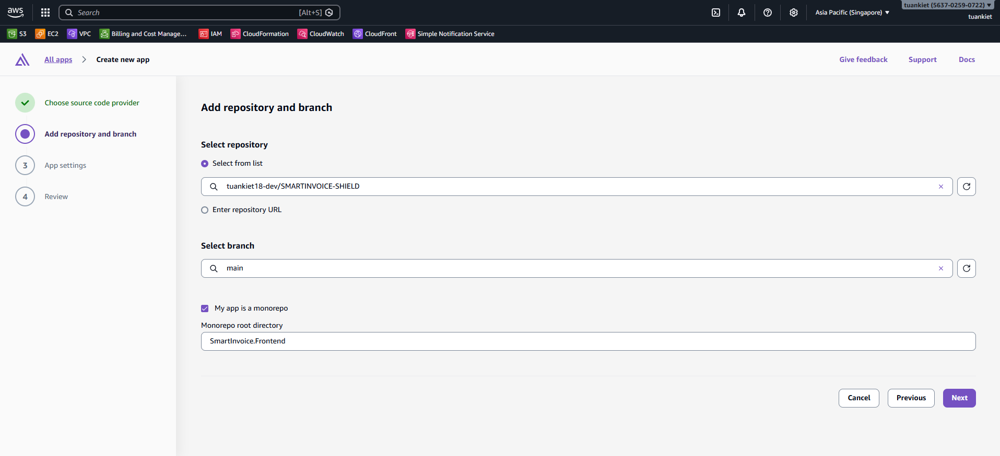
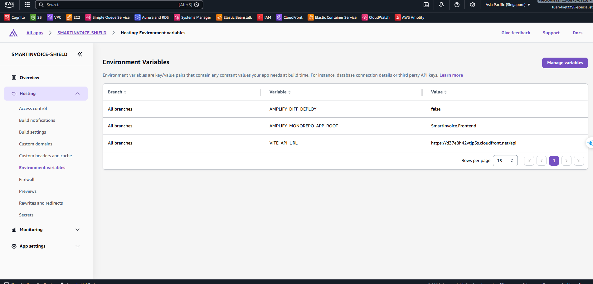

Phần này bao gồm Bước 16–18: cấu hình CloudFront làm HTTPS proxy cho Backend API, triển khai ReactJS frontend lên AWS Amplify, và cấu hình tên miền tùy chỉnh với Route 53.

---

## Bước 16: Cấu hình HTTPS với CloudFront (Proxy cho Backend)

CloudFront đóng vai trò làm cổng HTTPS công khai cho Backend API.

### 16.1 Bắt đầu

**Console**: CloudFront → **Create distribution**

| Trường            | Giá trị                      |
| ----------------- | ---------------------------- |
| Distribution name | `smartinvoice-backend-proxy` |
| Distribution type | **Single website or app**    |

### 16.2 Cấu hình Origin

| Trường        | Giá trị                                                                                     |
| ------------- | ------------------------------------------------------------------------------------------- |
| Origin type   | **Elastic Load Balancer**                                                                   |
| Origin domain | DNS Name của **EB ALB** (Ví dụ: `awseb-e-m-AWSEBLoa-xxxx.ap-southeast-1.elb.amazonaws.com`) |
| Protocol      | **HTTP only**, HTTP Port: `80`                                                              |

### 16.3 Default Cache Behavior

| Trường                  | Giá trị                                          |
| ----------------------- | ------------------------------------------------ |
| Viewer protocol policy  | **Redirect HTTP to HTTPS**                       |
| Allowed HTTP methods    | **GET, HEAD, OPTIONS, PUT, POST, PATCH, DELETE** |
| Cache policy            | `CachingDisabled`                                |
| Origin request policy   | `AllViewerExceptHostHeader`                      |
| Response headers policy | `CORS-With-Preflight`                            |

### 16.4 Bảo mật & Review

- **Rate limiting**: ✅ Bật (Recommended — chống spam API)

→ Nhấn **Create distribution** và chờ ~5 phút để triển khai.

→ Ghi lại **CloudFront domain** (Ví dụ: `https://d3xxxx.cloudfront.net`) — đây sẽ là URL API cho frontend.

---

## Bước 17: Triển khai Frontend trên Amplify

### 17.1 Kết nối Branch

1. **Console**: AWS Amplify → **All apps** → **New app** → **Host web app**.
2. Kết nối GitHub Repository `tuankiet18-dev/SMARTINVOICE-SHIELD`, chọn Branch `main`.

### 17.2 Build Settings (amplify.yml)

Amplify sẽ tự nhận diện Vite. Kiểm tra App settings → Build settings

### 17.3 Environment Variables

**Console**: App settings → **Environment variables** → Thêm:

| Key            | Value                                                                     |
| -------------- | ------------------------------------------------------------------------- |
| `VITE_API_URL` | Domain CloudFront từ Bước 16 (Ví dụ: `https://d3xxxx.cloudfront.net/api`) |

→ Sau khi deploy, copy **Amplify URL** và cập nhật SSM parameter `ALLOWED_ORIGINS`.

---

## Bước 18: Cấu hình Tên miền tùy chỉnh (Route 53)

Sau khi triển khai Frontend lên Amplify, bạn có thể thiết lập thêm một tên miền tùy chỉnh (custom domain).

1. **Console**: Route 53 → **Hosted zones**
2. Đảm bảo bạn đã đăng ký một domain từ trước hoặc đã tạo một Hosted Zone.
3. **Console**: AWS Amplify → App settings → **Domain management** → **Add domain**
4. Nhập tên miền tùy chỉnh của bạn và nhấn **Configure domain**.
5. Amplify sẽ tự động tạo chứng chỉ SSL (SSL certificate) và cung cấp các bản ghi CNAME để xác thực.
6. Sao chép và thêm các bản ghi CNAME này vào Hosted Zone trên Route 53 của bạn.
7. Đợi DNS cập nhật và xác minh SSL (có thể mất vài giờ, thông thường ~15 phút).
8. Sau khi xác minh thành công, giao diện web sẽ có thể truy cập an toàn qua tên miền tùy chỉnh của bạn.
