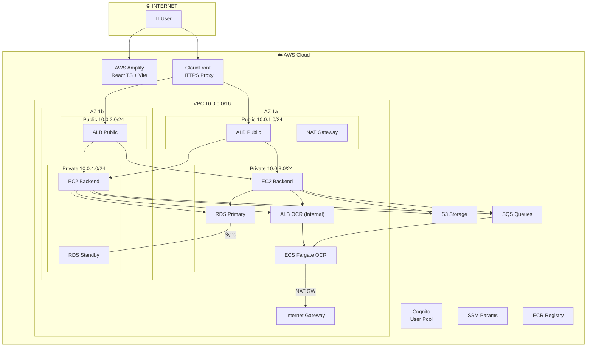

> **Version**: 2.0 | **Region**: `ap-southeast-1` (Singapore) | **Architecture**: 2 AZ, Multi-AZ RDS, ALB, NAT GW, ECS Fargate

## System Architecture Diagram

## Subnet Table

| Subnet                    | CIDR          | AZ  | Type    | Contains                            |
| ------------------------- | ------------- | --- | ------- | ----------------------------------- |
| `smartinvoice-public-1a`  | `10.0.1.0/24` | 1a  | Public  | ALB Public, NAT GW                  |
| `smartinvoice-public-1b`  | `10.0.2.0/24` | 1b  | Public  | ALB Public                          |
| `smartinvoice-private-1a` | `10.0.3.0/24` | 1a  | Private | ALB Internal, EC2, RDS, ECS Fargate |
| `smartinvoice-private-1b` | `10.0.4.0/24` | 1b  | Private | EC2 Backend, RDS Standby            |

## Deployment Steps Overview (~4 hours total)

| Step | Description                        | Time |
| ---- | ---------------------------------- | ---- |
| 1    | Choose Region & Prepare            | 5'   |
| 2    | Create VPC & Subnets               | 15'  |
| 3    | Create Internet Gateway            | 5'   |
| 4    | Create NAT Gateway                 | 10'  |
| 5    | Create Route Tables                | 10'  |
| 6    | Create Security Groups             | 15'  |
| 7    | Create IAM Roles                   | 15'  |
| 8    | Create S3 Bucket                   | 5'   |
| 9    | Create Amazon Cognito              | 15'  |
| 10   | Create SQS Queues                  | 10'  |
| 11   | Create SSM Parameter Store         | 15'  |
| 12   | Create RDS PostgreSQL              | 15'  |
| 13   | Create ECR & Push Docker Images    | 20'  |
| 14   | Deploy OCR (ECS Fargate)           | 20'  |
| 15   | Deploy Backend (Elastic Beanstalk) | 20'  |
| 16   | Configure HTTPS (CloudFront)       | 15'  |
| 17   | Deploy Frontend (Amplify)          | 10'  |
| 18   | CI/CD (GitHub Actions)             | 10'  |
| 19   | CloudWatch Monitoring              | 15'  |
| 20   | End-to-End Verification            | 15'  |

## Estimated Monthly Costs

| Service        | Configuration        | Cost (USD/month) |
| -------------- | -------------------- | ---------------- |
| EC2 (EBS)      | 2x t3.micro          | ~$15             |
| RDS PostgreSQL | db.t3.micro Multi-AZ | ~$28             |
| ECS Fargate    | 2 tasks (0.25 vCPU)  | ~$20             |
| NAT Gateway    | 1 zone + data        | ~$35             |
| ALB (Backend)  | 1 ALB                | ~$18             |
| **TOTAL**      |                      | **~$116**        |
